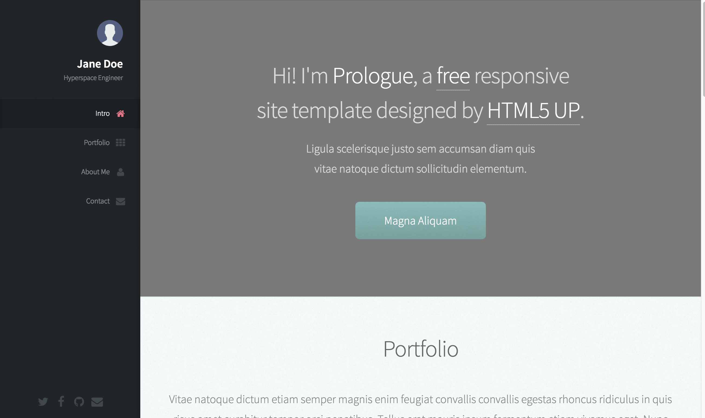

# prologue-like-jekyll-theme

Welcome! This is a new Jekyll theme! I'm using the [Prologue](https://html5up.net/prologue) theme from [HTML5 UP](https://html5up.net/) as a base to this Jekyll theme.

## Screenshot



## Installation

Add this line to your Jekyll site's Gemfile:

```ruby
gem "prologue-like-jekyll-theme"
```

And add this line to your Jekyll site:

```yaml
theme: prologue-like-jekyll-theme
```

And then execute:

    $ bundle

Or install it yourself as:

    $ gem install prologue-like-jekyll-theme

## Contributing

Bug reports and pull requests are welcome on GitHub at https://github.com/mhadaniya/hello. This project is intended to be a safe, welcoming space for collaboration, and contributors are expected to adhere to the [Contributor Covenant](http://contributor-covenant.org) code of conduct.


## License

The avatar icon was made by [Madebyoliver](http://www.flaticon.com/authors/madebyoliver) from [Flaticon](http://www.flaticon.com) and is licensed by [Creative Commons BY 3.0](http://creativecommons.org/licenses/by/3.0/)

The [Prologue](https://html5up.net/prologue) is licensed under the [Creative Commons Attribution](https://creativecommons.org/licenses/by/3.0/) license.

The theme is available as open source under the terms of the [MIT License](http://opensource.org/licenses/MIT).
